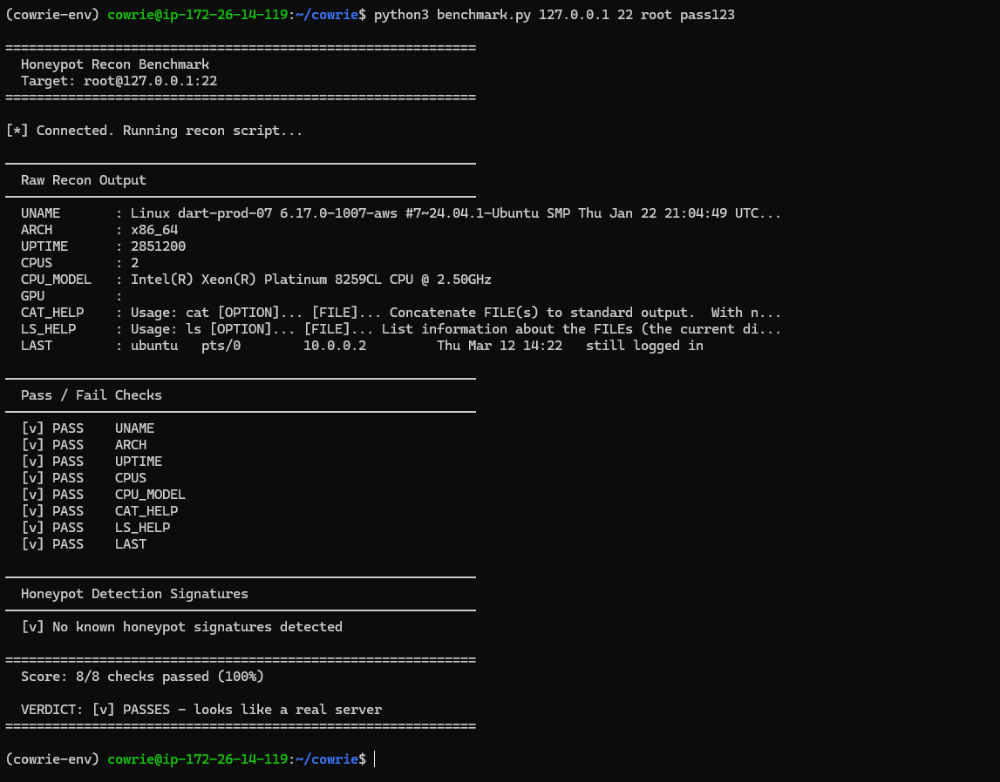
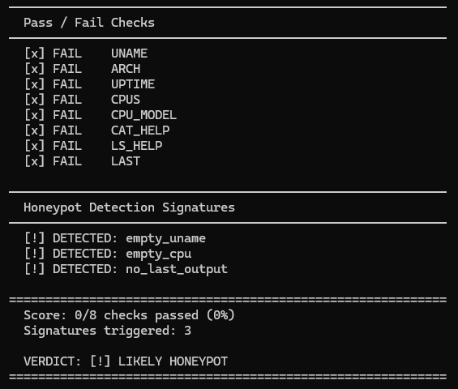

# honeypot-tools - Improve your Cowrie honeypot
On a normal installation of Cowrie, I could never get any of the bots to drop their malware - I waited days and got nothing..

Using this dockerfile, I had malware dropped on my honeypot twice within 30 minutes of starting it.

Here I've compiled a few configuration files that I used for my $5 AWS lightsail honeypot.
This Dockerfile is meant to be used with Cowrie in proxy mode, it provides an high level of interactivity and emulates a long-running server with multiple users, realistic filesystem and processes.

### Setup
In your `cowrie.cfg` file, ensure proxy mode is ON.

Find this line:
```
backend = shell
```
And change it to:
```
backend = proxy
```

Then configure your proxy section to listen on localhost, with a simple backend, and your port of choice.
```
[proxy]
backend = simple
backend_ssh_host = localhost
backend_ssh_port = 2223
```
Now build the docker container
```
docker build -t cowrie-backend .
```
And run the container
```
docker run -d \
  --name cowrie-backend \
  --restart unless-stopped \
  --hostname dart-prod-07 \
  -p 127.0.0.1:2223:22 \
  --memory=256m \
  --cpus=0.5 \
  --pids-limit=150 \
  cowrie-backend
```
Now start cowrie 
```
cowrie start
```
### Benchmark
I built this benchmark by observing the tactics of real-life malware dropper bots, this is the series of checks they run to determine if a host is worth proceeding with, or if its a honeypot.

initiate the script:
```
python benchmark.py <host< <port> <user> <pass>
```
Heres how it ran on the Dockerfile

And for anyone curious, this is how it runs on a standard Cowrie installtion.


These are the same commands bots use to decide your honeypot isnt worth dropping malware on.
